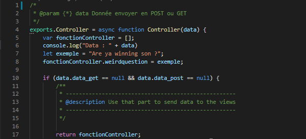
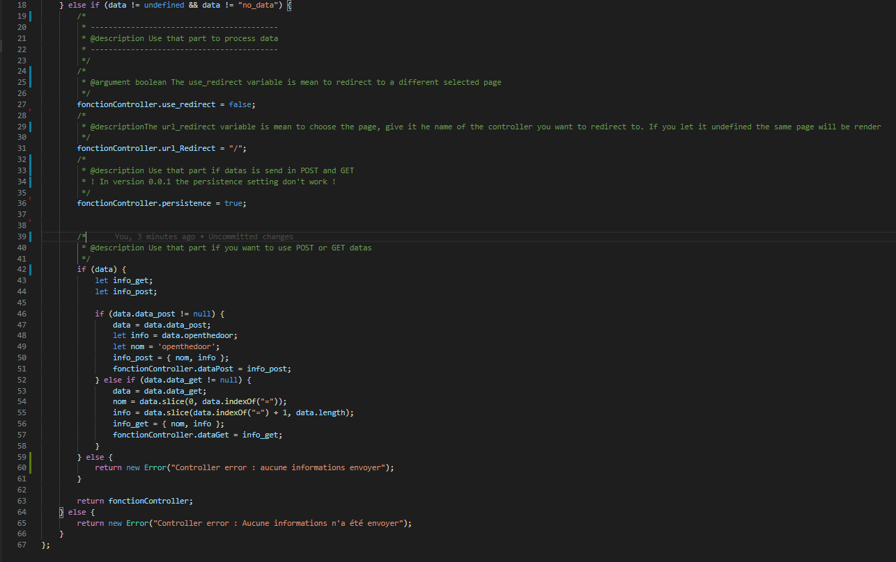
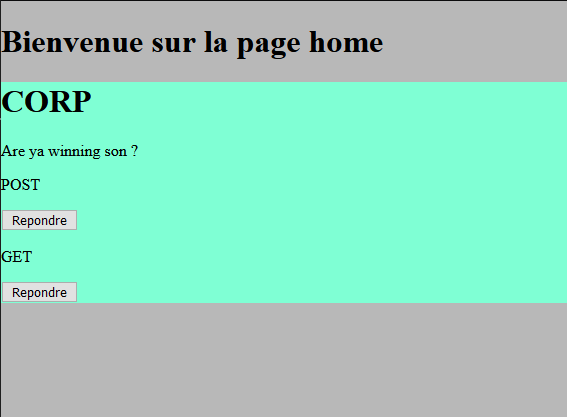
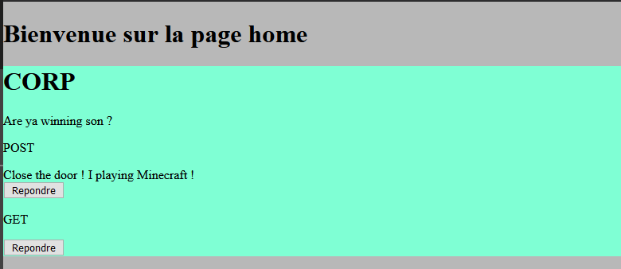
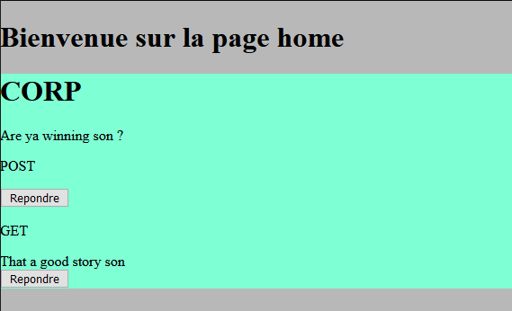

## FR Version

# NodeJS Serveur
Serveur basic Node JS Utilisant ExpresseJS
# Première version de RapideNodeJS utilisant ExpressJS
Version actuelle 0.0.1

# Possiblité de RapideNodeJS :
RapideNodeJS est juste un serveur basique utilisant Node JS.
Il est avantageux pour quiconque voudrait créer rapidement une page ou bien voudrait un support de départ pour son propre serveur NodeJS.
Il n'est pas recommandé de l'utiliser comme serveur de Prod mais seulement de Dev.

## Package utiliser
* body-parser
* express
* child_process
* ejs
## Package conseiler
* Nodemon
* favicon
* fs-extra
* mocha

## Qu'est t'il possible de faire avec RapideNodeJS ?
* Créer un site en utilisant le model MVC.
* Créer rapidement une page son css ainsi que son contrôleur grâce à l'utilitaire *Teta.
* Choisir l'url que l'on veut pour sa page ou même en mettre plusieurs.

## Comment le lancer ?
Si vous avez Node JS installer sur votre système il vous suffit de lancer cette commande
#### CMD
```
Laucher
```
#### Powershell
```
.\Laucher
```
Une fois cela fait ouvrir votre navigateur et aller a l'addresse `localhost:4444`

--------------
## Les utilitaires en commande prompt

Teta est l'utilitaire qui vous permet de générer les fichiers tels que le contrôleur, la vue, le css et de choisir l'url attribuée à la page.
Il s'ouvre simplement en double cliquant dessus ou en tapant son nom dans un CMD : Teta ou .\Teta via powershell
(n'oubliez pas de vous situer dans le dossier principal pour le lancer).
#### CMD
```
Teta
```
#### Powershell
```
.\Teta
```
## Commande utilisable
---------------------------
Création d'une nouvelle page
```
np
```
ou
```
New Page
```
Vous permet de générer le contrôleur, la vue, le css
vous avez deux options. 
* Default <br />
Vous donnez un nom et il sera attribué à tout les fichiers ainsi qu'à l'url.
* Personnaliser <br />
Vous pourrez choisir le nom du contrôleur, de la vue et du css ainsi que des ou de l'url.

L'aide affichant toutes les commandes disponibles.
```
help
```
Vous permet de quitter l'inviter de commande
```
exit
```
## Fonctionnement de RapidNodeJS
Par défaut le contrôleur fonctionne comme un énorme tableau, 
toutes les données peuvent donc être envoyées dans un tableau typé, un tableau normal, ou une seule variable, 
tout dépend de comment vous voulez le traiter dans votre vue.

Exemple : 
### Controller
 <br />
Dans le controller la variable ```fonctionController``` est un tableau dans lequel devra être mise chacune des variables
qui devra être envoyée à la vue.  <br />
Le premier `if` gère les informations envoyées à la vue et le deuxième lui gère la récupération des informations. <br />
 <br />
Dans la deuxième image du contrôleur on traite les informations renvoyées par la page. <br />
Les informations sont envoyées sous cette forme : `datas = { data_get, data_post };` <br />
Les données sont donc accessibles comme suit : <br />
Pour le POST : `data.data_post`<br />
Pour le GET : `data.data_get`<br />
### Vue
 <br />
Comme on le peut le voir la variable `weirdquestion` est accessible par la variable `Controller` dans la vue. <br />
### Navigateur
 <br />
La variable s'affiche bien sur le navigateur. <br />
Bien et maintenant quand une variable est passée en GET ou POST ? <br />

 <br />
On peut voir que la variable s'affiche bien grâce à `Controller.dataPost.info` Note : `dataPost` est le nom de la variable définie dans le contrôleur <br />
 <br />
On peut voir que la variable s'affiche bien grâce à `Controller.Get.info` Note : `dataGet` est le nom de la variable définie dans le contrôleur. <br />

*Note : ce projet est toujours en cours à l'heure qu'il est 27/09/2020
 
